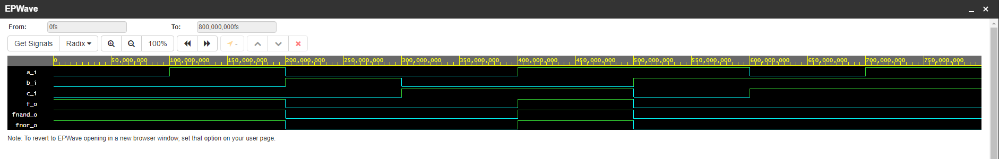
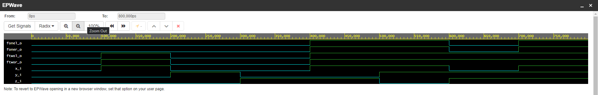

# Lab assignment

## Assignment 1
Link to my GitHub repository: (https://github.com/FilipNim/Digital-electronics-1.git)

## Assignment 2 

### 1)
```
library IEEE;
use IEEE.std_logic_1164.all;


entity gates is
    port(
        a_i    : in  std_logic;         -- Data input
        b_i    : in  std_logic;         -- Data input
        c_i    : in  std_logic;
        f_o    : out std_logic;
        fnand_o    : out std_logic;
        fnor_o    : out std_logic         
    );
end entity gates;

------------------------------------------------------------------------
-- Architecture body for basic gates
------------------------------------------------------------------------
architecture dataflow of gates is
begin
    f_o  <= ((not b_i) and a_i) or ((not c_i) and (not b_i));
    fnand_o <= ( a_i nand ( b_i nand b_i ) )   nand ( ( b_i nand b_i ) nand (c_i nand c_i) );
	fnor_o <= ((((a_i nor a_i) nor b_i) nor (b_i nor c_i))   nor  (((a_i nor a_i) nor b_i) nor (b_i nor c_i)));   

end architecture dataflow;
```

 c | b | a | f(c,b,a)
 - | - | - | --------
 0 | 0 | 0 |    1
 0 | 0 | 1 |    1
 0 | 1 | 0 |    0
 0 | 1 | 1 |    0
 1 | 0 | 0 |    0
 1 | 0 | 1 |    1
 1 | 1 | 0 |    0
 1 | 1 | 1 |    0

### 2)


### 3)
Link to EDA Playground: (https://www.edaplayground.com/x/BdXU)

## Assignment 3 

### 1)
```
entity gates is
    port(
        x_i    : in  std_logic;         -- Data input
        y_i    : in  std_logic;         -- Data input
        z_i    : in  std_logic;
        fonel_o    : out std_logic;
        foner_o    : out std_logic;
        ftwol_o    : out std_logic;
        ftwor_o    : out std_logic

);
end entity gates;

------------------------------------------------------------------------
-- Architecture body for basic gates
------------------------------------------------------------------------
architecture dataflow of gates is
begin

	fonel_o <= (x_i and y_i) or (x_i and z_i);
    foner_o <= (x_i and (y_i or z_i));
    ftwol_o <= (x_i or y_i) and (x_i or z_i);
    ftwor_o <= x_i or (y_i and z_i);
end architecture dataflow;
```

### 2)


### 3)
Link to EDA Playground: https://www.edaplayground.com/x/Q48p

