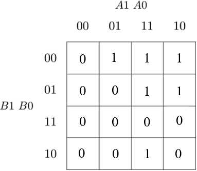
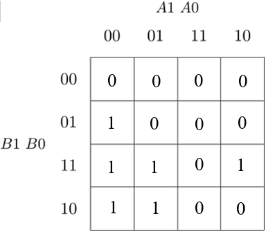

# Lab Assignment

## Assignment 1
 
 | **Dec. equivalent** | **B[1:0]** | **A[1:0]** | **B is greater than A** | **B equals A** | **B is less than A** |
 | :-: | :-: | :-: | :-: | :-: | :-: |
 | 0 | 0 0 | 0 0 | 0 | 1 | 0 |
 | 1 | 0 0 | 0 1 | 0 | 0 | 1 |
 | 2 | 0 0 | 1 0 | 0 | 0 | 1 |
 | 3 | 0 0 | 1 1 | 0 | 0 | 1 |
 | 4 | 0 1 | 0 0 | 1 | 0 | 0 |
 | 5 | 0 1 | 0 1 | 0 | 1 | 0 |
 | 6 | 0 1 | 1 0 | 0 | 0 | 1 |
 | 7 | 0 1 | 1 1 | 0 | 0 | 1 |
 | 8 | 1 0 | 0 0 | 1 | 0 | 0 |
 | 9 | 1 0 | 0 1 | 1 | 0 | 0 |
| 10 | 1 0 | 1 0 | 0 | 1 | 0 |
| 11 | 1 0 | 1 1 | 0 | 0 | 1 |
| 12 | 1 1 | 0 0 | 1 | 0 | 0 |
| 13 | 1 1 | 0 1 | 1 | 0 | 0 |
| 14 | 1 1 | 1 0 | 1 | 0 | 0 |
| 15 | 1 1 | 1 1 | 0 | 1 | 0 |

equals_SoP = m0 + m5 + m10 +m15 = (/B1 * /B0 * /A1 * /A0) + (/B1 * B0 * /A1 * A0) + (B1 * /B0 * A1 * /A0) + (B1 * B0 * A1 * A0)

less_PoS = M0 * M4 * M5 * M8 * M9 * M10 * M12 * M13 * M14 * M15 = (B1 + B0 + A1 + A0) * (B1 + /B0 + A1 + A0) * (B1 + /B0 + A1 + /A0) * (/B1 + B0 + A1 + A0) * (/B1 + B0 + A1 + /A0) * (/B1 + B0 + /A1 + A0) * (/B1 + /B0 + A1 + A0) * (/B1 + /B0 + A1 + /A0) * (/B1 + /B0 + /A1 + A0) * (/B1 + /B0 + /A1 + /A0)

## Assignment 2

### 1)
The K-map for the "equals" function is as follows:


The K-map for the "less" function is as follows:



The K-map for the "greater" function is as follows:



### 2)

greater_SoP_min = (B1 * /A1) + (B0 * /A1 * /A0) + (B1 * B0 * /A0)

less_PoS_min = (A1 + A0) * (/B1 + /B0) * (/B1 + A1) * (/B0 + A0) * (/B1 * A0)

### 3)

Link to EDA Playground: (https://www.edaplayground.com/x/cP9j)

## Assignment 3

### 1)

```VHDL
------------------------------------------------------------------------
-- Entity declaration for 2-bit binary comparator
------------------------------------------------------------------------
entity comparator_2bit is
    port(
        a_i           : in  std_logic_vector(4 - 1 downto 0);
		b_i           : in  std_logic_vector(4 - 1 downto 0);
		B_greater_A_o : out std_logic;
        B_equals_A_o  : out std_logic;
        B_less_A_o    : out std_logic       -- B is less than A
    );
end entity comparator_2bit;

------------------------------------------------------------------------
-- Architecture body for 2-bit binary comparator
------------------------------------------------------------------------
architecture Behavioral of comparator_4bit is
begin
    B_greater_A_o <= '1' when (b_i > a_i) else '0';
    B_less_A_o <= '1' when (b_i < a_i) else '0';
    B_equals_A_o <= '1' when (b_i = a_i) else '0';

end architecture Behavioral;
```

