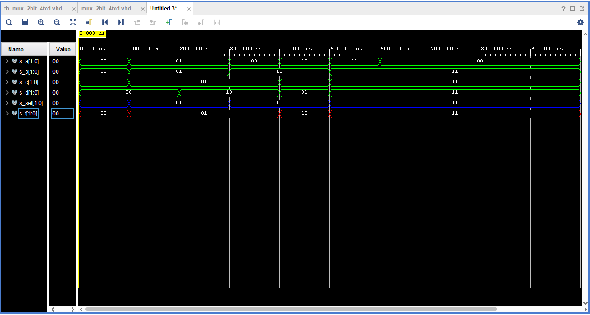

# Lab Assignment

## Assignment 1

| **Switch** | **Input-Switch** |  **Output-LED**  |
| :-: | :-: | :-: |
| 0 | J15 | H17 |
| 1 | L16 | K15 |
| 2 | M13 | J13 |
| 3 | R15 | N14 |
| 4 | R17 | R18 |
| 5 | T18 | V17 |
| 6 | U18 | U17 |
| 7 | R13 | U16 |
| 8 | T8 | V16 |
| 9 | U8 | T15 |
| 10 | R16 | U14 |
| 11 | T13 | T16 |
| 12 | H6 | V15 |
| 13 | U12 | V14 |
| 14 | U11 | V12 |
| 15 | V10 | V11 |


## Assignment 2

### 1) VHDL architecture from source file

```VHDL
library IEEE;
use IEEE.std_logic_1164.all;

entity mux_2bit_4to1 is
    port(
        a_i           : in  std_logic_vector(2 - 1 downto 0);
		b_i           : in  std_logic_vector(2 - 1 downto 0);
        c_i           : in  std_logic_vector(2 - 1 downto 0);
        d_i           : in  std_logic_vector(2 - 1 downto 0);
        sel_i         : in  std_logic_vector(2 - 1 downto 0);
        
        
        f_o           : out std_logic_vector(2 - 1 downto 0)
    );
end entity mux_2bit_4to1;

architecture Behavioral of mux_2bit_4to1 is
begin
    f_o    <= a_i when (sel_i = "00") else
              b_i when (sel_i = "01") else
              c_i when (sel_i = "10") else
              d_i;

end architecture Behavioral;
```
### 2) VHDL stimulus process from testbench file

```VHDL
library IEEE;
use IEEE.STD_LOGIC_1164.ALL;


entity tb_mux_2bit_4to1 is
--  Port ( );
end tb_mux_2bit_4to1;

architecture testbench of tb_mux_2bit_4to1 is

-- Local signals
    signal s_a       : std_logic_vector(2 - 1 downto 0);
    signal s_b       : std_logic_vector(2 - 1 downto 0);
    signal s_c       : std_logic_vector(2 - 1 downto 0);
    signal s_d       : std_logic_vector(2 - 1 downto 0);
    signal s_sel     : std_logic_vector(2 - 1 downto 0);
    
    signal s_f       : std_logic_vector(2 - 1 downto 0);
    
begin
    uut_mux_2bit_4to1 : entity work.mux_2bit_4to1
        port map(
            a_i           => s_a,
            b_i           => s_b,
            c_i           => s_c,
            d_i           => s_d,
            sel_i         => s_sel,
            f_o           => s_f
        );
        
    p_stimulus : process
    begin
        -- Report a note at the beginning of stimulus process
        report "Stimulus process started" severity note;

        s_a <= "00"; s_b <= "00"; s_c <= "00"; s_d <= "00";
        s_sel <= "00"; wait for 100 ns;
        
        s_a <= "01"; s_b <= "01"; s_c <= "01"; s_d <= "00";
        s_sel <= "01"; wait for 100 ns;
        
        s_a <= "01"; s_b <= "01"; s_c <= "01"; s_d <= "10";
        s_sel <= "01"; wait for 100 ns;
        
        s_a <= "00"; s_b <= "10"; s_c <= "01"; s_d <= "10";
        s_sel <= "10"; wait for 100 ns;
        
        s_a <= "10"; s_b <= "10"; s_c <= "10"; s_d <= "01";
        s_sel <= "10"; wait for 100 ns;
        
        s_a <= "11"; s_b <= "11"; s_c <= "11"; s_d <= "11";
        s_sel <= "11"; wait for 100 ns;
        
        s_a <= "00"; s_b <= "11"; s_c <= "11"; s_d <= "11";
        s_sel <= "11"; wait for 100 ns;
        
        -- Report a note at the end of stimulus process
        report "Stimulus process finished" severity note;
        wait;
    end process p_stimulus;
    end architecture testbench;
```
### 3)


