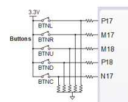
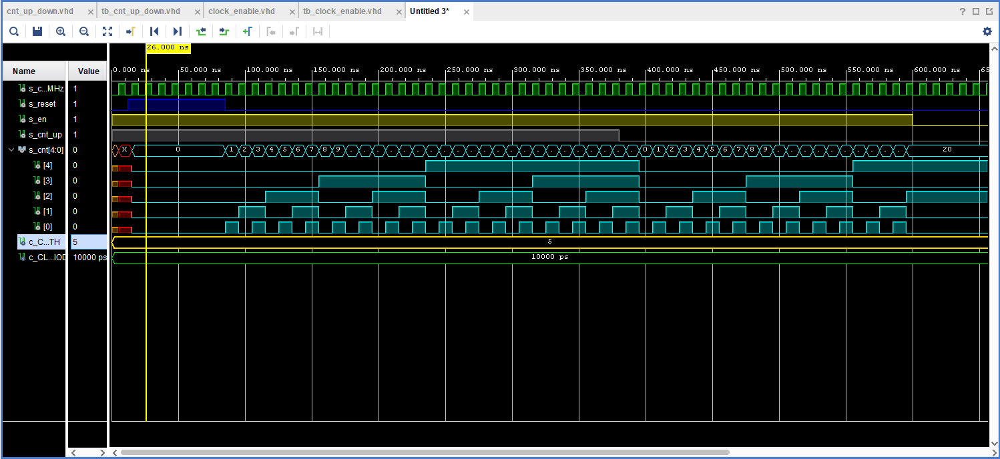
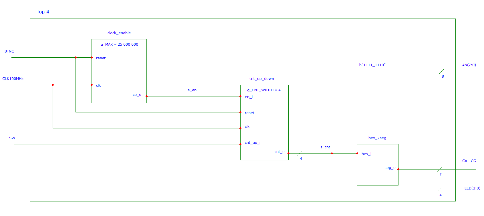
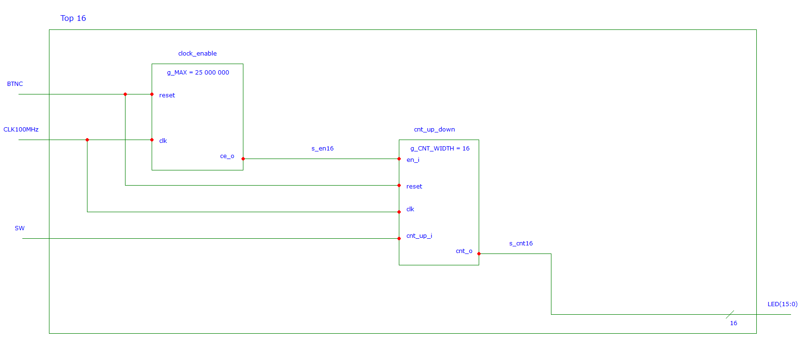

# Lab Assignment

## Assignment 1

### 1) Connection of push buttons on Nexys A7 board



### 2) 

   | **Time interval** | **Number of clk periods** | **Number of clk periods in hex** | **Number of clk periods in binary** |
   | :-: | :-: | :-: | :-: |
   | 2&nbsp;ms | 200 000 | `x"3_0d40"` | `b"0011_0000_1101_0100_0000"` |
   | 4&nbsp;ms | 400 000 | `x"6_1a80"` | `b"0110_0001_1010_1000_0000"` |
   | 10&nbsp;ms | 1 000 000 | `x"f_4240"` | `b"1111_0100_0010_0100_0000"` |
   | 250&nbsp;ms | 25 000 000 | `x"17d_7840"` | `b"0001_0111_1101_0111_1000_0100_0000"` |
   | 500&nbsp;ms | 50 000 000 | `x"2fa_f080"` | `b"0010_1111_1010_1111_0000_1000_0000"` |
   | 1&nbsp;sec | 100 000 000 | `x"5F5_E100"` | `b"0101_1111_0101_1110_0001_0000_0000"` |

## Assignment 2

### 1) VHDL code of the process p_cnt_up_down

```VHDL
p_cnt_up_down : process(clk)
    begin
        if rising_edge(clk) then
        
            if (reset = '1') then               -- Synchronous reset
                s_cnt_local <= (others => '0'); -- Clear all bits

            elsif (en_i = '1') then 
                
                
               if (cnt_up_i = '1') then                    
                   s_cnt_local <= s_cnt_local + 1;
                   
               else 
                   s_cnt_local <= s_cnt_local + 1;        

             end if;

           end if;
       end if;
       
 end process p_cnt_up_down;
```
### 2) VHDL reset and stimulus processes from testbench file tb_cnt_up_down.vhd

```VHDL
 p_reset_gen : process
    begin
        s_reset <= '0';
        wait for 12 ns;
        s_reset <= '1';                 -- Reset activated
        wait for 73 ns;
        s_reset <= '0';
        wait;
    end process p_reset_gen;

    --------------------------------------------------------------------
    -- Data generation process
    --------------------------------------------------------------------
    p_stimulus : process
    begin
        report "Stimulus process started" severity note;

        s_en     <= '1';                -- Enable counting
        s_cnt_up <= '1';
        wait for 380 ns;                -- Change counter direction
        s_cnt_up <= '0';
        wait for 220 ns;
        s_en     <= '0';                -- Disable counting

        report "Stimulus process finished" severity note;
        wait;
    end process p_stimulus;
```
### 3) Screenshot with simulated time waveforms



## Assignment 3

### 1) VHDL code from source file top.vhd with all instantiations

```VHDL
clk_en0 : entity work.clock_enable
        generic map(
            g_MAX => 250000000--- WRITE YOUR CODE HERE
        )
        port map(
            clk => CLK100MHZ,
            reset => BTNC,
            ce_o => s_en
            --- WRITE YOUR CODE HERE
        );

    --------------------------------------------------------------------
    -- Instance (copy) of cnt_up_down entity
    bin_cnt0 : entity work.cnt_up_down
        generic map(
            g_CNT_WIDTH => 4--- WRITE YOUR CODE HERE
        )
        port map(
            clk => CLK100MHZ,
            reset => BTNC,
            en_i => s_en,
            cnt_up_i => SW(0),
            cnt_o    => s_cnt
        );

    -- Display input value on LEDs
    LED(3 downto 0) <= s_cnt;

    --------------------------------------------------------------------
    -- Instance (copy) of hex_7seg entity
    hex2seg : entity work.hex_7seg
        port map(
            hex_i    => s_cnt,
            seg_o(6) => CA,
            seg_o(5) => CB,
            seg_o(4) => CC,
            seg_o(3) => CD,
            seg_o(2) => CE,
            seg_o(1) => CF,
            seg_o(0) => CG
        );
```
### 2) 4-bit bidirectional counter and a 16-bit counter




