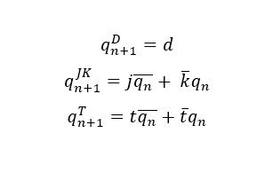
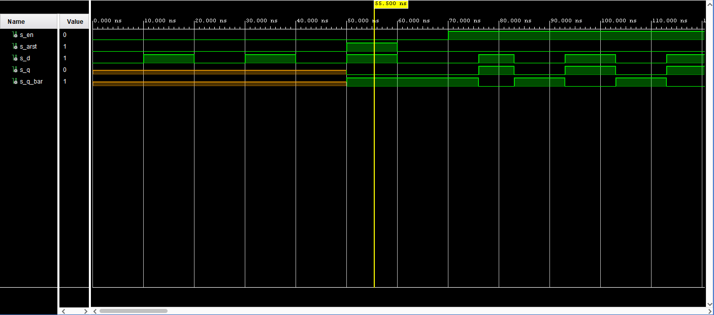
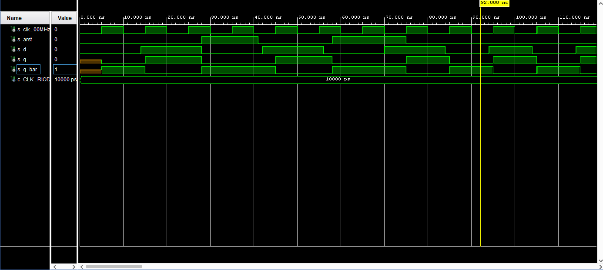
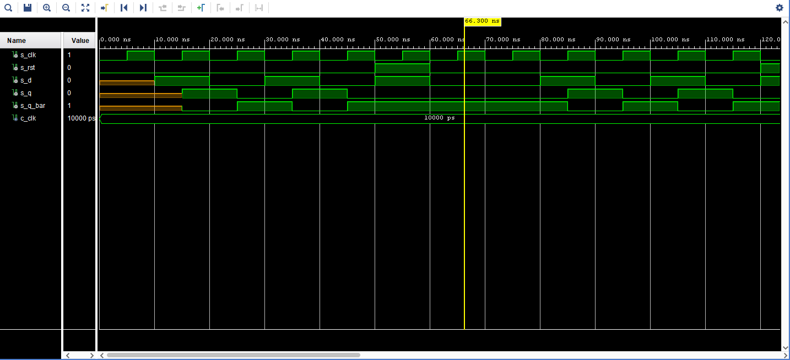
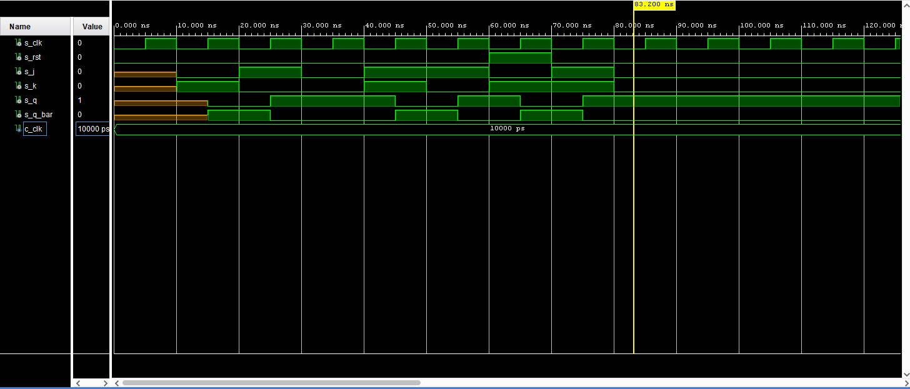
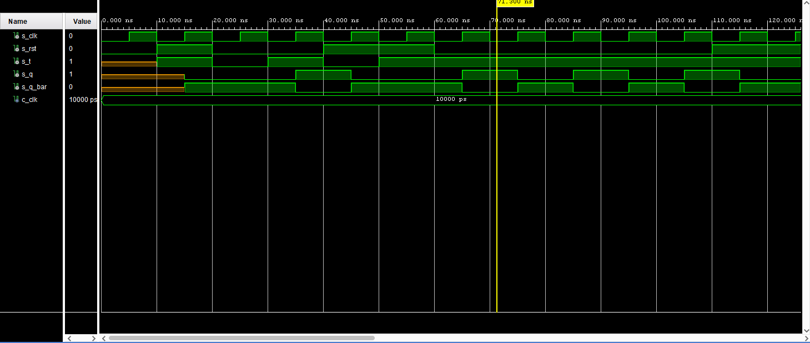
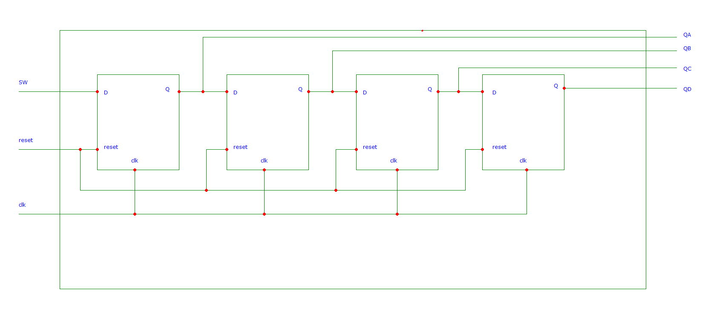

### Lab Assignment

## Assignment 1

### 1) Equations


 
 ### 2) Tables for D, JK, T flip-flops

   | **clk** | **d** | **qn** | **q(n+1)** | **Comments** |
   | :-: | :-: | :-: | :-: | :-: |
   | ↑ | 0 | 0 | 0 | No change |
   | ↑ | 0 | 1 | 0 | No change |
   | ↑ | 1 | 0 | 1 | q(n+1) |
   | ↑ | 1 | 1 | 1 | q(n+1) |


   | **clk** | **j** | **k** | **qn** | **q(n+1)** | **Comments** |
   | :-:| :-: | :-: | :-: | :-: | :-- |
   | ↑ | 0 | 0 | 0 | 0 | No change |
   | ↑ | 0 | 0 | 1 | 1 | No change |
   | ↑ | 0 | 1 | 0 | 0 | Reset |
   | ↑ | 0 | 1 | 1 | 0 | Reset |
   | ↑ | 1 | 0 | 0 | 1 | Set |
   | ↑ | 1 | 0 | 1 | 1 | Set |
   | ↑ | 1 | 1 | 0 | 1 | Toggle |
   | ↑ | 1 | 1 | 1 | 0 | Toggle |


   | **clk** | **t** | **qn** | **q(n+1)** | **Comments** |
   | :-: | :-: | :-: | :-: | :-- |
   | ↑ | 0 | 0 | 1 | No change |
   | ↑ | 0 | 1 | 0 | No change |
   | ↑ | 1 | 0 | 0 | Toggle |
   | ↑ | 1 | 1 | 1 | Toggle |

## Assignment 2

### 1) VHDL code listing of the process p_d_latch

```VHDL
p_d_latch : process (d, arst, en)
begin
    if (arst = '1') then
        q <= '0';
        q_bar <= '1';
        
    elsif(en = '1')then
        q <= d;
        q_bar <= not d;
       
    end if;
end process p_d_latch;
```
### 2) Listing of VHDL reset and stimulus processes from the testbench tb_d_latch.vhd

```VHDL
p_reset_gen : process
    begin
        s_arst <= '0';
        wait for 50 ns;
        
        -- Reset activated
        s_arst <= '1';
        wait for 10 ns;

        s_arst <= '0';
        wait for 62 ns;
        
        -- Reset activated
        s_arst <= '1';
        wait for 50 ns;

        s_arst <= '0';
        wait for 49 ns;
        
        s_arst <= '1';
        wait;
        
    end process p_reset_gen;

p_stimulus : process
    begin
        s_d <= '0';
        s_en <='0';
        
        wait for 10ns;
        s_d <= '1';
        wait for 10ns;
        s_d <= '0';
        wait for 10ns;
        s_d <= '1';
        wait for 10ns;
        s_d <= '0';
        wait for 10ns;
        s_d <= '1';
        wait for 10ns;
        s_d <= '0';
        wait for 10ns;
        
        s_en <= '1';
        
        wait for 6ns;
        s_d <= '1';
        wait for 7ns;
        s_d <= '0';
        wait for 10ns;
        s_d <= '1';
        wait for 10ns;
        s_d <= '0';
        wait for 10ns;
        s_d <= '1';
        wait for 10ns;
        s_d <= '0';
        wait for 10ns;
        
        s_en <= '0';
        
        wait for 10ns;
        s_d <= '1';
        wait for 10ns;
        s_d <= '0';
        wait for 10ns;
        s_d <= '1';
        wait for 10ns;
        s_d <= '0';
        wait for 10ns;
        s_d <= '1';
        wait for 10ns;
        s_d <= '0';
        wait for 10ns;
        
end process p_stimulus;

p_asserts :process
    begin
        wait for 55 ns;
        assert(s_en = '0' and s_arst = '1' and s_d = '1' and s_q = '0' and s_q_bar = '1') report "Error" severity  error;
        
        wait for 25 ns;
        assert(s_en = '1' and s_arst = '0' and s_d = '1' and s_q = '1' and s_q_bar = '0' ) report "Error" severity  error;
        
        wait for 20 ns;
        assert(s_en = '1' and s_arst = '0' and s_d = '1' and s_q = '1' and s_q_bar = '0') report "Error" severity  error;
        
        wait for 10 ns;
        assert(s_en = '1' and s_arst = '0' and s_d = '0' and s_q = '0' and s_q_bar = '1' ) report "Error" severity  error;
        
        
        
end process p_asserts;
```

### 3) Screenshot with simulated time waveforms



## Assignment 3

### 1) d_ff_arst

#### VHDL code listing of the processes 

```VHDL
p_d_ff_arst : process (arst, clk)
begin
    if (arst = '1') then
        q <= '0';
        q_bar <= '1';
        
    elsif rising_edge(clk)then
        q <= d;
        q_bar <= not d;
       
    end if;
end process p_d_ff_arst;
```
#### Listing of VHDL clock, reset and stimulus processes from the testbench

```VHDL
p_clk_gen : process
    begin
        while now < 750 ns loop         -- 75 periods of 100MHz clock
            s_clk_100MHz <= '0';
            wait for c_CLK_100MHZ_PERIOD / 2;
            s_clk_100MHz <= '1';
            wait for c_CLK_100MHZ_PERIOD / 2;
        end loop;
        wait;
    end process p_clk_gen;
    
    p_reset_gen : process
    begin
        s_arst <= '0';
        wait for 28 ns;
        
        -- Reset activated
        s_arst <= '1';
        wait for 13 ns;
        s_arst <= '0';
        
        wait for 17 ns;
        s_arst <= '1';
        
        wait for 17 ns;
        s_arst <= '0';
        wait;
    end process p_reset_gen;

p_stimulus : process
    begin
        s_d <= '0';

        wait for 14ns;
        s_d <= '1';
        wait for 14ns;
        s_d <= '0';
        wait for 14ns;
        s_d <= '1';
        wait for 14ns;
        s_d <= '0';
        wait for 14ns;
        s_d <= '1';
        wait for 14ns;
        s_d <= '0';
        
        
        wait for 10ns;
        s_d <= '1';
        wait for 10ns;
        s_d <= '0';
        wait for 10ns;
        s_d <= '1';
        wait for 10ns;
        s_d <= '0';
        wait for 10ns;
        s_d <= '1';
        wait for 10ns;
        s_d <= '0';

end process p_stimulus;
p_asserts :process
    begin
        wait for 18 ns;
        assert(s_clk = '1' and s_arst = '0' and s_d = '1' and s_q = '1' and s_q_bar = '0') report "Error" severity  error;
        
        wait for 15 ns;
        assert(s_clk = '0' and s_arst = '1' and s_d = '0' and s_q = '0' and s_q_bar = '1' ) report "Error" severity  error;
        
        wait for 33 ns;
        assert(s_clk = '1' and s_arst = '1' and s_d = '0' and s_q = '0' and s_q_bar = '1') report "Error" severity  error;
        
        wait for 26 ns;
        assert(s_clk = '0' and s_arst = '0' and s_d = '0' and s_q = '0' and s_q_bar = '1' ) report "Error" severity  error;
       
end process p_asserts;
```
#### Screenshot with simulated time waveforms



### 2) d_ff_rst

#### VHDL code listing of the processes 

```VHDL
p_d_ff_rst : process (clk)
    begin
        if rising_edge(clk) then
            if (rst = '1') then
                q     <= '0';
                q_bar <= '1';
            else
                q     <= d;
                q_bar <= not d;    
            end if;         
        end if;
  end process p_d_ff_rst;
```
#### Listing of VHDL clock, reset and stimulus processes from the testbench

```VHDL
p_clk_gen : process
    begin
        while now < 750 ns loop         -- 75 periods of 100MHz clock
            s_clk_100MHz <= '0';
            wait for c_CLK_100MHZ_PERIOD / 2;
            s_clk_100MHz <= '1';
            wait for c_CLK_100MHZ_PERIOD / 2;
        end loop;
        wait;
    end process p_clk_gen;
    
       p_rst : process
        begin
            s_rst <= '0';
            wait for 50 ns;
            
            -- Reset activated
            s_rst <= '1';
            wait for 10 ns;
    
            s_rst <= '0';
    
            wait for 60 ns;
            
            s_rst <= '1';
            wait for 20 ns;
            
            s_rst <= '0';
            wait for 20 ns;
            
            s_rst <= '1';
            wait for 10 ns;
            
            wait;
    end process p_rst;
    
    p_stimulus : process
        begin

            
            wait for 10 ns;
            s_d  <= '1';
            wait for 10 ns;
            s_d  <= '0';
            wait for 10 ns;
            s_d  <= '1';
            wait for 10 ns;
            s_d  <= '0';
            wait for 10 ns;
            s_d  <= '1';
            wait for 10 ns;
            s_d  <= '0';
            wait for 10 ns;
  
            
  
    end process p_stimulus;
    
        p_asserts :process
    begin
  
        
        wait for 18 ns;
        assert(s_clk = '1' and s_rst = '0' and s_d = '1' and s_q = '1' and s_q_bar = '0') report "Error" severity  error;
        
        wait for 10 ns;
        assert(s_clk = '1' and s_rst = '0' and s_d = '0' and s_q = '0' and s_q_bar = '1') report "Error" severity  error;
        
        wait for 30 ns;
        assert(s_clk = '1' and s_rst = '1' and s_d = '1' and s_q = '0' and s_q_bar = '1') report "Error" severity  error;
        
        wait;
        
    end process p_asserts;

```
#### Screenshot with simulated time waveforms



### 3) jk_ff_rst

#### VHDL code listing of the processes 

```VHDL
    p_jk_ff_rst : process (clk)
    begin
        if rising_edge(clk) then
            if (rst = '1') then
                s_q <= '0';
            else 
                if (j = '0' and k = '0') then
                    s_q <= s_q;
                    
                elsif (j = '0' and k = '1') then
                    s_q <= '0';
                
                elsif (j = '1' and k = '0') then
                    s_q <= '1';
                
                elsif (j = '1' and k = '1') then
                    s_q <= not s_q;

            end if;
          end if;       
        end if;
        
 end process p_jk_ff_rst;  
    q <= s_q;
    q_bar <= not s_q;
```
#### Listing of VHDL clock, reset and stimulus processes from the testbench

```VHDL
p_clk_gen : process
    begin
        while now < 750 ns loop         -- 75 periods of 100MHz clock
            s_clk_100MHz <= '0';
            wait for c_CLK_100MHZ_PERIOD / 2;
            s_clk_100MHz <= '1';
            wait for c_CLK_100MHZ_PERIOD / 2;
        end loop;
        wait;
    end process p_clk_gen;
    
           p_rst : process
        begin
            s_rst <= '0';
            wait for 60 ns;
            
    
            s_rst <= '1';
            wait for 10 ns;
    
            s_rst <= '0';
            wait for 80 ns;
            
            s_rst <= '1';
            wait for 20 ns;
            
            
            wait;
    end process p_rst;
    
    p_stimulus : process
        begin
            
            wait for 10 ns; 
            s_j  <= '0';
            s_k  <= '1';
            
            wait for 10 ns;  
            s_j  <= '1';
            s_k  <= '0';
            
            wait for 10 ns;  
            s_j  <= '0';
            s_k  <= '0';
            
            wait for 10 ns; 
            s_j  <= '1';
            s_k  <= '1';
            
            wait for 10 ns;  
            s_j  <= '1';
            s_k  <= '0';
            
            wait for 10 ns;  
            s_j  <= '0';
            s_k  <= '1';
            
            wait for 10 ns;  
            s_j  <= '1';
            s_k  <= '1';
            
            wait for 10 ns; 
            s_j  <= '0';
            s_k  <= '0';
            

            wait;
            
    end process p_stimulus;
    
    p_asserts : process
        begin
            
            wait for 18 ns;
            assert(s_clk = '1' and s_rst = '0' and s_j = '0' and s_k = '1' and s_q = '0' and s_q_bar = '1') report "Error" severity  error;
            
            wait for 10 ns;
            assert(s_clk = '1' and s_rst = '0' and s_j = '1' and s_k = '0' and s_q = '1' and s_q_bar = '0' ) report "Failed" severity  error;
            
            wait for 35 ns;
            assert(s_clk = '0' and s_rst = '1' and s_j = '0' and s_k = '1' and s_q = '1' and s_q_bar = '0' ) report "Failed" severity  error;
            
            wait for 20 ns;
            assert(s_clk = '0' and s_rst = '0' and s_j = '0' and s_k = '0' and s_q = '1' and s_q_bar = '0') report "Failed" severity  error;
        
            wait;
        
    end process p_asserts;

```
#### Screenshot with simulated time waveforms



### 4) t_ff_rst

#### VHDL code listing of the processes 

```VHDL
    p_t_ff_rst : process (clk)
    begin
        if rising_edge(clk) then
            if (rst = '1') then
                s_q <= '0';
            else
                if (t = '0') then
                    s_q <= s_q;
                else
                    s_q <= not s_q;
               end if;
           end if;
       end if;
    end process p_t_ff_rst;       
```
#### Listing of VHDL clock, reset and stimulus processes from the testbench

```VHDL
p_clk_gen : process
    begin
        while now < 750 ns loop         -- 75 periods of 100MHz clock
            s_clk_100MHz <= '0';
            wait for c_CLK_100MHZ_PERIOD / 2;
            s_clk_100MHz <= '1';
            wait for c_CLK_100MHZ_PERIOD / 2;
        end loop;
        wait;
    end process p_clk_gen;
    
         p_rst : process
        begin
            
            s_rst <= '0';
            wait for 10 ns;
            
            s_rst <= '1';
            wait for 10 ns;
            
            s_rst <= '0';
            wait for 20 ns;
            
            s_rst <= '1';
            wait for 20 ns;
    
            s_rst <= '0';
            wait for 50 ns;
            
            s_rst <= '1';
            wait for 30 ns;
            
            
            
            wait;
    end process p_rst;
    
    p_stimulus : process
        begin
            
            wait for 10 ns; 
            s_t  <= '1';
            
            wait for 10 ns;
            s_t  <= '0';
            
            wait for 10 ns; 
            s_t  <= '1';
            
            wait for 10 ns; 
            s_t  <= '0';
            
            wait for 10 ns; 
            s_t  <= '1';
                        
            wait for 10 ns; 
            s_t  <= '1';
           
            wait;
            
    end process p_stimulus;
    
    p_asserts : process
        begin
            
            wait for 18 ns;
            assert(s_clk = '1' and s_rst = '1' and s_t = '1'  and s_q = '1' and s_q_bar = '0') report "Error" severity  error;
            
            wait for 20 ns;
            assert(s_clk = '1' and s_rst = '0' and s_t = '1'  and s_q = '1' and s_q_bar = '0' ) report "Error" severity  error;
            
            wait for 15 ns;
            assert(s_clk = '0' and s_rst = '1' and s_t = '1'  and s_q = '0' and s_q_bar = '1' ) report "Error" severity  error;
               
            wait;
        
    end process p_asserts;
```
#### Screenshot with simulated time waveforms



## Assignment 4

### Image of the shift register schematic

